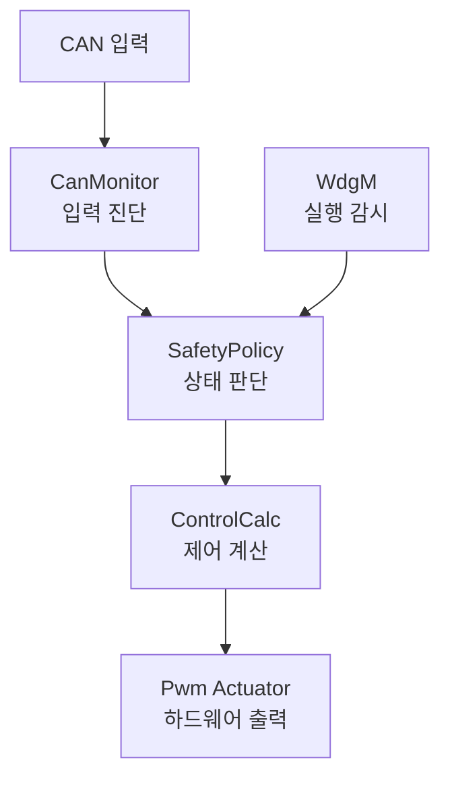

# 컨셉 디자인 (Concept Design)

**Document ID**: STEER-02-CD  
**Version**: 1.0  
**Date**: 2026-08-22  
**Status**: Draft (Submission Summary)  
**Project Title**: AUTOSAR 기반 조향 관련 오류에 대한 복구 및 진단 시스템  
**Subtitle**: 입력 ECU와 출력 ECU로 분리된 조향 진단 및 FAIL-SAFE 제어 구조

---

## 1. 문서 목적

본 문서는 시스템 요구사항을 만족하기 위한 전체 구성, ECU 경계, 기능 블록 및 데이터 흐름을 개념 수준에서 정의한다. 제출본에서는 함수, 변수, 임계값 및 코드와 같은 구현 상세보다 각 기능의 책임과 연결 관계를 중심으로 설명한다.

## 2. 시스템 개요

| 항목 | 내용 |
|---|---|
| 시스템 목적 | 조향 입력 및 ECU 내부 실행 이상을 감지하고, 이상 발생 시 안전 상태로 전환하여 의도하지 않은 조향 출력을 방지한다. |
| 입력 정보 | 운전자 조향 입력, 조향 정보 갱신 상태, 내부 실행 감시 상태 |
| 판단 기능 | 통신 이상 및 입력 유효성 판단, 내부 실행 상태 감시, NORMAL/FAIL-SAFE 상태 결정 |
| 제어 기능 | 유효한 조향 입력을 기반으로 조향 방향과 출력 크기를 계산한다. |
| 출력 기능 | PWM, 좌·우 방향 신호 및 정지 상태를 하드웨어 출력으로 전달한다. |
| ECU 구성 | 조향 입력을 생성·송신하는 입력 ECU와 진단·안전 판단·제어·출력을 수행하는 출력 ECU로 구성한다. |
| 통신 구조 | 입력 ECU와 출력 ECU 사이의 CAN 통신 및 출력 ECU 내부 AUTOSAR RTE 통신 |
| 안전 동작 | 입력 또는 내부 실행 이상 발생 시 FAIL-SAFE 상태로 전환하고 조향 출력을 제한한다. |
| 복귀 동작 | 정의된 정상 조건이 지속적으로 확인된 경우에만 NORMAL 상태로 복귀한다. |

## 3. 전체 시스템 구조

### 출력 ECU 기능 구조

## 4. 구조 설명

| 그림 번호 | 구분 | 설명 |
|---|---|---|
| 02-01 | 전체 시스템 구조 | 운전자 조향 입력이 입력 ECU에서 수집된 후 CAN을 통해 출력 ECU로 전달되고, 진단·안전 판단·제어 계산을 거쳐 하드웨어로 출력되는 시스템 경계를 보여준다. |
| 02-02 | 출력 ECU 기능 구조 | CanMonitor, SafetyPolicy, ControlCalc 및 Pwm_Actuator가 RTE 인터페이스로 연결되고 WdgM 상태가 안전 판단에 사용되는 기능 관계를 보여준다. |

## 5. ECU 및 기능 블록 책임

| 영역 | 기능 블록 | 주요 책임 | 관련 요구사항 |
|---|---|---|---|
| 입력 ECU | SteeringSensor | 운전자 조향 입력을 수집하고 갱신 정보를 포함한 조향 정보를 출력 ECU로 전달한다. | Req_001, Req_002 |
| 차량 네트워크 | CAN Communication | 입력 ECU와 출력 ECU 사이에서 조향 정보를 전달한다. | Req_002, Req_003 |
| 출력 ECU | CanMonitor | 조향 정보의 갱신 상태와 입력 유효성을 확인하고 진단 결과를 생성한다. | Req_003, Req_004 |
| 출력 ECU/BSW | WdgM | 조향 제어 관련 내부 기능의 정상 실행 여부를 감시한다. | Req_005 |
| 출력 ECU | SafetyPolicy | 입력 진단 결과와 내부 실행 상태를 종합하여 NORMAL/FAIL-SAFE 상태를 결정하고 안전 출력을 선택한다. | Req_006~Req_008 |
| 출력 ECU | ControlCalc | 정상 상태에서 유효한 조향 입력을 기반으로 조향 방향과 출력 크기를 계산한다. | Req_009 |
| 출력 ECU | Pwm_Actuator | 계산된 제어값을 IoHwAb를 통해 PWM, 방향 신호 및 정지 상태로 출력한다. | Req_010 |
| 진단 인터페이스 | Status Monitoring | 시스템 동작 상태와 진단된 Fault 상태를 외부에서 확인할 수 있도록 제공한다. | Req_011 |

## 6. 데이터 및 실행 흐름

| 단계 | 송신 영역 | 수신 영역 | 전달 정보 | 실행 방식 |
|---:|---|---|---|---|
| 1 | 조향 입력 장치 | SteeringSensor | 조향 입력값 | 입력 ECU의 주기 실행 |
| 2 | SteeringSensor | CanMonitor | 조향 정보 및 갱신 상태 | CAN 메시지 주기 송신 후 Data Received Event |
| 3 | CanMonitor | SafetyPolicy | 검증된 조향 정보 및 입력 Fault 상태 | 데이터 전달 이벤트 |
| 4 | WdgM | SafetyPolicy | 내부 실행 감시 상태 | WdgM API 조회 |
| 5 | SafetyPolicy | ControlCalc | 안전 상태가 반영된 조향 정보 및 출력 허용 상태 | 데이터 전달 이벤트 |
| 6 | ControlCalc | Pwm_Actuator | PWM 값, 좌·우 방향 및 구동 상태 | 데이터 전달 이벤트 |
| 7 | Pwm_Actuator | 하드웨어 | PWM, 방향 신호 및 정지 LED 상태 | IoHwAb 호출 |

> 입력 ECU의 SteeringSensor는 10 ms 주기로 CAN 메시지를 송신한다. 출력 ECU의 CanMonitor, SafetyPolicy, ControlCalc 및 Pwm_Actuator는 각각 앞 단계의 데이터 수신·전달 이벤트에 따라 연쇄 실행되므로 모든 SWC를 독립적인 10 ms 주기 Runnable로 정의하지 않는다.

## 7. 안전 상태 개념

| 상태 | 진입 조건 | 시스템 동작 | 복귀 조건 |
|---|---|---|---|
| NORMAL | 입력 정보와 내부 실행 상태가 정상 | 조향 입력을 이용한 방향 및 출력 계산을 허용한다. | 해당 없음 |
| FAIL-SAFE | 통신 이상, Invalid 입력 또는 내부 실행 이상 검출 | 조향 제어 출력을 제한하고 정지 상태를 하드웨어에 전달한다. | 정의된 정상 조건이 지속적으로 충족된 경우에만 NORMAL로 복귀한다. |

## 8. 설계 규칙

| 규칙 | 내용 |
|---|---|
| ECU 책임 분리 | 입력 ECU는 조향 정보의 생성과 송신을 담당하고, 출력 ECU는 진단·안전 판단·제어·출력을 담당한다. |
| 기능 책임 분리 | 입력 진단, 안전 상태 판단, 제어 계산 및 하드웨어 출력을 독립 기능 블록으로 분리한다. |
| 인터페이스 기반 연결 | 기능 블록 사이의 데이터는 AUTOSAR Port와 Interface를 통해 전달한다. |
| 통합 안전 판단 | 입력 진단 결과와 WdgM 실행 상태를 SafetyPolicy에서 종합하여 최종 시스템 상태를 결정한다. |
| 안전 출력 우선 | Fault가 검출된 경우 정상 제어 계산보다 FAIL-SAFE 출력 제한을 우선 적용한다. |
| 안전한 복귀 | 일시적인 정상 입력만으로 FAIL-SAFE를 해제하지 않고 지속적인 정상 조건을 확인한 후 복귀한다. |
| 하드웨어 추상화 | 애플리케이션 SWC는 IoHwAb를 통해 PWM 및 디지털 출력에 접근한다. |

## 9. 요구사항 할당 요약

| 요구사항 그룹 | 개념 설계 반영 위치 | 후속 상세화 문서 |
|---|---|---|
| Req_001, Req_002 | 입력 ECU와 CAN 통신 경계 | `0302_NWflowDef.md`, `0303_Communication_Specification.md` |
| Req_003~Req_005 | CanMonitor 및 WdgM 진단 구조 | `03_Function_definition.md`, `0301_SysFuncAnalysis.md` |
| Req_006~Req_008 | SafetyPolicy 및 NORMAL/FAIL-SAFE 상태 구조 | `03_Function_definition.md`, `04_SW_Implementation.md` |
| Req_009, Req_010 | ControlCalc, Pwm_Actuator 및 IoHwAb 구조 | `0304_System_Variables.md`, `04_SW_Implementation.md` |
| Req_011 | 상태 및 Fault 모니터링 경로 | `0303_Communication_Specification.md`, `04_SW_Implementation.md` |

---

본 문서는 시스템 수준의 개념 구조와 기능 할당을 정의한다. CAN ID, Signal 배치, 자료형, 진단 횟수, 상태 전이 횟수, PWM 계산식 및 하드웨어 핀과 같은 상세 기준은 `03~04` 설계·구현 문서에서 관리한다.
