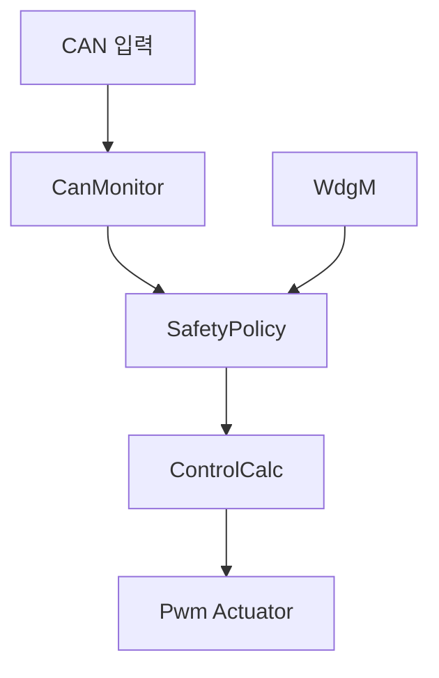

# 시스템 설계 명세서 (System Design Specification)

**Document ID**: STEER-02-SDS  
**ISO 26262 Reference**: Part 4, Cl.7 (System Design)  
**ASPICE Reference**: SYS.3 / SWE.2  
**Version**: 1.0  
**Date**: 2026-08-22  
**Status**: Draft  
**Project Title**: AUTOSAR 기반 조향 관련 오류에 대한 복구 및 진단 시스템  
**Subtitle**: 시스템 구조, 기능 할당, 통신 및 데이터 통합 설계

---

## 1. 문서 목적

본 문서는 시스템 요구사항 `Req_001~Req_011`을 구현하기 위한 ECU 구조, 기능 할당, 데이터 흐름, 통신 명세, 인터페이스, 시스템 변수 및 안전 상태 설계를 통합 정의한다. 기존 `02_Concept_design.md`와 `0301~0304` 문서의 역할을 하나의 기준 문서로 통합한다.

## 2. 시스템 아키텍처

### 출력 ECU 기능 구조

## 3. 기능 할당

| Design ID | ECU/계층 | 기능 블록 | 주요 책임 | 관련 요구사항 |
|---|---|---|---|---|
| DES-IN-001 | 입력 ECU/ASW | SteeringSensor | 조향 입력을 수집하고 갱신 정보를 포함한 CAN 메시지를 생성한다. | Req_001, Req_002 |
| DES-COM-001 | 입력·출력 ECU/BSW | CAN Communication | 입력 ECU에서 출력 ECU로 조향 정보와 Alive Counter를 전달한다. | Req_002, Req_003 |
| DES-DIAG-001 | 출력 ECU/ASW | CanMonitor | CAN 정보의 갱신 상태를 확인하여 Timeout Fault를 생성한다. | Req_003 |
| DES-DIAG-002 | 출력 ECU/ASW | CanMonitor | 수신 조향각의 유효 범위를 검사하여 Invalid Fault를 생성한다. | Req_004 |
| DES-WDGM-001 | 출력 ECU/BSW | WdgM | SafetyPolicy의 실행 상태를 감시하고 Global Status를 제공한다. | Req_005 |
| DES-SAFE-001 | 출력 ECU/ASW | SafetyPolicy | 입력 Fault와 WdgM Fault를 종합하여 NORMAL/FAIL-SAFE 상태를 결정한다. | Req_006 |
| DES-SAFE-002 | 출력 ECU/ASW | SafetyPolicy | FAIL-SAFE 상태에서 조향값과 출력 허용 상태를 안전값으로 설정한다. | Req_007 |
| DES-SAFE-003 | 출력 ECU/ASW | SafetyPolicy | 정상 조건이 지속적으로 확인된 경우에만 NORMAL 상태로 복귀한다. | Req_008 |
| DES-CTRL-001 | 출력 ECU/ASW | ControlCalc | 조향 변화량을 이용하여 방향과 PWM Duty를 계산한다. | Req_009 |
| DES-ACT-001 | 출력 ECU/ASW·IoHwAb | Pwm_Actuator | 계산된 PWM, 방향 및 정지 상태를 하드웨어로 출력한다. | Req_010 |
| DES-MON-001 | 출력 ECU/진단 경로 | Status Monitoring | 현재 상태와 Fault 상태를 외부에서 확인할 수 있도록 제공한다. | Req_011 |

## 4. 데이터 및 네트워크 흐름

| Flow ID | 송신 | 수신 | 전달 데이터 | 전달 방식 | 실행 조건 |
|---|---|---|---|---|---|
| FLOW-01 | Potentiometer | SteeringSensor | 조향 입력값 | IoHwAb Read | 입력 ECU 주기 실행 |
| FLOW-02 | SteeringSensor | CanMonitor | 조향각, Alive Counter | CAN | 10 ms 송신, Data Received Event 수신 |
| FLOW-03 | CanMonitor | SafetyPolicy | 조향각, Fault Flag | RTE Sender-Receiver | 데이터 수신·전달 이벤트 |
| FLOW-04 | WdgM | SafetyPolicy | WdgM Global Status | RTE Client-Server | SafetyPolicy 실행 중 API 호출 |
| FLOW-05 | SafetyPolicy | ControlCalc | 안전 조향값, 출력 Fault Flag | RTE Sender-Receiver | 데이터 전달 이벤트 |
| FLOW-06 | ControlCalc | Pwm_Actuator | PWM 값, Left, Right, Keep_Go | RTE Sender-Receiver | 데이터 전달 이벤트 |
| FLOW-07 | Pwm_Actuator | PWM·Digital Output | PWM, 방향, 정지 LED | IoHwAb Call | Actuator Runnable 실행 |

> SteeringSensor만 명시적인 10 ms 주기 Runnable로 구성된다. 출력 ECU의 CanMonitor, SafetyPolicy, ControlCalc 및 Pwm_Actuator는 앞 단계의 데이터 수신·전달 이벤트에 따라 연쇄 실행된다.

## 5. CAN 통신 명세

| Message | Identifier | DLC | Signal | Byte 위치 | Data Type | Data 범위 | 송신 주기 | 송신→수신 |
|---|---:|---:|---|---|---|---|---|---|
| Project_SSU_SteerInfo | `0x100` | 3 Byte | SSU_SteerAngle | Byte 0~1 | `sint16` | -512~511 | 10 ms | SteeringSensor → CanMonitor |
|  |  |  | SSU_AliveCounter | Byte 2 | `uint8` | 0~255 | 10 ms | SteeringSensor → CanMonitor |

## 6. Port 및 Interface 정의

| Interface ID | 송신/제공 | 수신/요구 | 주요 Data/API | Interface 유형 |
|---|---|---|---|---|
| IF-01 | IoHwAb Potentiometer | SteeringSensor | 조향 입력 ReadDirect | Client-Server |
| IF-02 | SteeringSensor | CanMonitor | SSU_SteerAngle, SSU_AliveCounter | Sender-Receiver/CAN Mapping |
| IF-03 | CanMonitor | SafetyPolicy | Steer_info, Flag | Sender-Receiver |
| IF-04 | WdgM | SafetyPolicy | GetGlobalStatus, GetFirstExpiredSEID, CheckpointReached | Client-Server |
| IF-05 | SafetyPolicy | ControlCalc | Steerinfo, flag | Sender-Receiver |
| IF-06 | ControlCalc | Pwm_Actuator | Pwm_info, Left, Right, Keep_Go | Sender-Receiver |
| IF-07 | Pwm_Actuator | IoHwAb | SetDutyCycle, MotorIn1/2, StopLed | Client-Server |

## 7. 시스템 변수 정의

| Variable ID | Name | Data Type | 범위/값 | 초기값 | 사용 기능 | 설명 |
|---|---|---|---|---|---|---|
| VAR-001 | aliveCounter | `uint8` | 0~255 | 0 | SteeringSensor | CAN 메시지 갱신 상태 식별값 |
| VAR-002 | angle | `sint16` | -512~511 | 0 | SteeringSensor, CanMonitor | 조향 입력값 |
| VAR-003 | prevAliveCounter | `uint8` | 0~255 | 0 | CanMonitor | 이전 Alive Counter 저장값 |
| VAR-004 | firstValid | `boolean` | TRUE/FALSE | FALSE | CanMonitor | 최초 정상 수신 여부 |
| VAR-005 | sameCounterCnt | `uint8` | 0 이상 | 0 | CanMonitor | 동일 Alive Counter 연속 수신 횟수 |
| VAR-006 | inputFault | `boolean` | TRUE/FALSE | FALSE | CanMonitor, SafetyPolicy | Timeout/Invalid 통합 Fault 상태 |
| VAR-007 | gIsFailsafe | `boolean` | TRUE/FALSE | FALSE | SafetyPolicy | FAIL-SAFE 활성 상태 |
| VAR-008 | gNormalRecoverCnt | `uint8` | 0~3 | 0 | SafetyPolicy | 연속 정상 조건 확인 횟수 |
| VAR-009 | wdgmStatus | `WdgM_GlobalStatusType` | OK/FAILED/EXPIRED/STOPPED | OK | SafetyPolicy | WdgM Global Status |
| VAR-010 | prev_input_steer | `sint16` | -512~511 | 0 | ControlCalc | 이전 조향각 저장값 |
| VAR-011 | steer_diff | `sint16` | -1023~1023 | 0 | ControlCalc | 현재값과 이전값의 조향 변화량 |
| VAR-012 | AbsoluteDutyCycle | `sint16` | 0~32768 | 0 | ControlCalc, Pwm_Actuator | PWM Duty 출력값 |
| VAR-013 | Left | `boolean` | TRUE/FALSE | FALSE | ControlCalc, Pwm_Actuator | 좌측 방향 출력 상태 |
| VAR-014 | Right | `boolean` | TRUE/FALSE | FALSE | ControlCalc, Pwm_Actuator | 우측 방향 출력 상태 |
| VAR-015 | Keep_Go | `boolean` | TRUE/FALSE | FALSE | ControlCalc, Pwm_Actuator | 구동 허용 상태 |

## 8. 진단 및 상태 전이 설계

### 진단 조건

| Diagnostic ID | 입력 조건 | 판정 | 후속 동작 | 관련 Design ID |
|---|---|---|---|---|
| DIA-001 | 조향각 또는 Alive Counter RTE Read 실패 | 입력 Fault | SafetyPolicy에 Fault 전달 | DES-DIAG-001 |
| DIA-002 | 최초 정상 수신 이후 동일 Alive Counter 2회 이상 연속 수신 | Timeout Fault | SafetyPolicy에 Fault 전달 | DES-DIAG-001 |
| DIA-003 | 조향각이 -512~511 범위를 벗어남 | Invalid Fault | SafetyPolicy에 Fault 전달 | DES-DIAG-002 |
| DIA-004 | WdgM Global Status가 FAILED, EXPIRED 또는 STOPPED | 내부 실행 Fault | FAIL-SAFE 판단에 반영 | DES-WDGM-001 |

### 상태 전이

| 현재 상태 | 조건 | 다음 상태 | 출력 동작 |
|---|---|---|---|
| NORMAL | 입력 및 WdgM Fault 없음 | NORMAL | 유효한 조향 입력에 따라 방향과 PWM을 계산한다. |
| NORMAL | 입력 Fault 또는 WdgM Fault 발생 | FAIL-SAFE | 조향값과 PWM을 0으로 설정하고 방향·구동 출력을 차단한다. |
| FAIL-SAFE | 정상 조건 1회 또는 2회 | FAIL-SAFE | 출력 차단을 유지하고 복귀 카운터를 증가시킨다. |
| FAIL-SAFE | 정상 조건 3회 연속 | NORMAL | 복귀 카운터를 초기화하고 정상 출력을 다시 허용한다. |
| FAIL-SAFE | 정상 확인 중 Fault 재발 | FAIL-SAFE | 복귀 카운터를 0으로 초기화하고 출력 차단을 유지한다. |

## 9. 제어 및 하드웨어 출력 설계

| Control ID | 조건/입력 | 설계 동작 | 출력 |
|---|---|---|---|
| CTRL-001 | Fault Flag 활성 | 정상 제어 계산을 중단한다. | PWM 0, Left/Right/Keep_Go FALSE |
| CTRL-002 | 조향 변화량 > +2 | 우측 방향으로 판정한다. | Right TRUE |
| CTRL-003 | 조향 변화량 < -2 | 좌측 방향으로 판정한다. | Left TRUE |
| CTRL-004 | 조향 변화량 -2~+2 | 정지 상태로 판정한다. | PWM 0, Keep_Go FALSE |
| CTRL-005 | 조향 변화량 절댓값 > 512 | PWM 계산 입력을 제한한다. | 절댓값 512 적용 |
| CTRL-006 | Keep_Go FALSE | 하드웨어 출력을 정지 상태로 설정한다. | PWM 0, MotorIn1/2 FALSE, StopLed TRUE |

## 10. 요구사항-설계 추적성

| Requirement ID | Design ID | 주요 설계 근거 |
|---|---|---|
| Req_001 | DES-IN-001 | 조향 입력 수집 및 VAR-002 생성 |
| Req_002 | DES-IN-001, DES-COM-001 | FLOW-01~FLOW-02, CAN 메시지 명세 |
| Req_003 | DES-COM-001, DES-DIAG-001 | DIA-001~DIA-002 |
| Req_004 | DES-DIAG-002 | DIA-003 |
| Req_005 | DES-WDGM-001 | IF-04, DIA-004 |
| Req_006 | DES-SAFE-001 | NORMAL→FAIL-SAFE 상태 전이 |
| Req_007 | DES-SAFE-002, DES-ACT-001 | CTRL-001, CTRL-006 |
| Req_008 | DES-SAFE-003 | 정상 조건 3회 연속 복귀 |
| Req_009 | DES-CTRL-001 | CTRL-002~CTRL-005 |
| Req_010 | DES-ACT-001 | FLOW-06~FLOW-07, IF-07 |
| Req_011 | DES-MON-001 | 상태·Fault 모니터링 경로 |

---

본 문서는 시스템 설계의 단일 기준 문서로 사용한다. 동일한 설계 정보는 다른 문서에 중복 정의하지 않고, 후속 구현 및 시험 문서에서는 본 문서의 Design ID를 참조한다.
