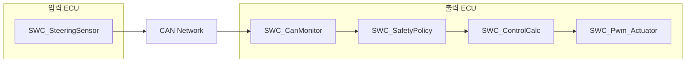
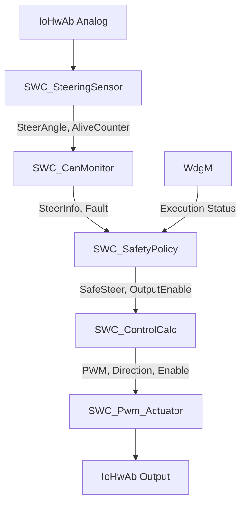
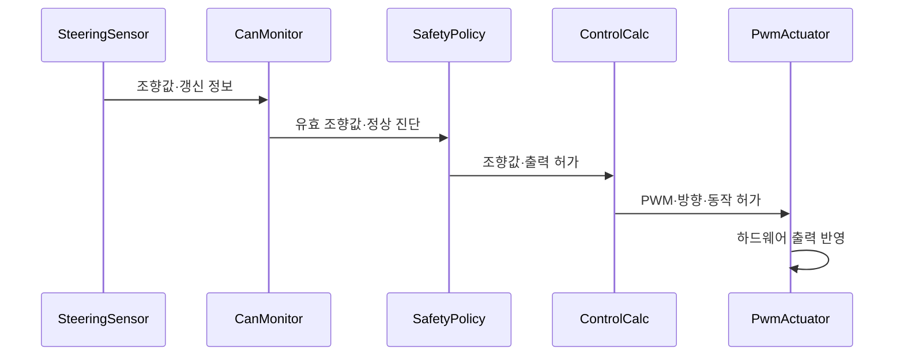
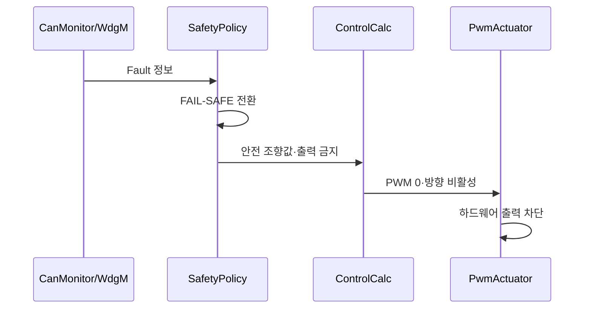

# 소프트웨어 아키텍처 설계 명세서 (Software Architecture Design Specification)

**Document ID**: STEER-0301-SWADS  
**ISO 26262 Reference**: Part 6, Cl.7  
**ASPICE Reference**: SWE.2  
**Version**: 1.0  
**Date**: 2026-08-24  
**Status**: Draft  
**Project Title**: AUTOSAR 기반 조향 관련 오류에 대한 복구 및 진단 시스템

---

## 1. 문서 목적

본 문서는 `03_SW_Requirements.md`의 `SWR-*`를 소프트웨어 구성요소에 할당하고, 입력 ECU와 출력 ECU의 SWC 구조, 책임, 인터페이스 및 실행 관계를 정의한다.

본 문서는 소프트웨어 아키텍처 수준을 다룬다. CAN 신호의 Byte 배치와 송신 파라미터는 `0303_Communication_Specification.md`, 상태값·Counter·임계값은 `0304_System_Variables.md`, RTE 호출 코드·내부 알고리즘·Task 설정·IoHwAb 핀 연결은 `04_SW_Design_Implementation.md`에서 구체화한다.

## 2. 아키텍처 설계 원칙

| 원칙 | 적용 내용 |
|---|---|
| 기능 분리 | 입력, 통신 진단, 안전 판단, 제어 계산 및 하드웨어 출력을 별도 SWC로 분리한다. |
| 단방향 데이터 흐름 | 조향 입력부터 하드웨어 출력까지 책임 순서에 따라 데이터를 전달한다. |
| 안전 우선 | 진단 결과와 내부 실행 상태를 제어 계산보다 먼저 안전 판단에 반영한다. |
| 인터페이스 기반 결합 | SWC 간 데이터는 정의된 Port와 Interface를 통해 전달한다. |
| ECU 책임 분리 | 입력 ECU는 입력 취득·송신, 출력 ECU는 진단·안전 판단·제어·출력을 담당한다. |
| 추적 가능성 | 모든 SWC와 인터페이스는 관련 `SWR-*`를 참조한다. |

## 3. ECU별 소프트웨어 구성

| SW Component ID | SWC | ECU 할당 | 주요 책임 |
|---|---|---|---|
| SWC-001 | SWC_SteeringSensor | 입력 ECU | 조향 입력 취득, 조향 정보 생성, 갱신 정보 생성 및 CAN 송신 |
| SWC-002 | SWC_CanMonitor | 출력 ECU | 조향 정보 수신, 통신 갱신 상태 및 입력 유효성 진단 |
| SWC-003 | SWC_SafetyPolicy | 출력 ECU | 입력 진단과 내부 실행 상태 통합, NORMAL/FAIL-SAFE 판단 및 복귀 관리 |
| SWC-004 | SWC_ControlCalc | 출력 ECU | 안전 상태를 반영한 방향·출력 크기 계산 및 정지 결정 |
| SWC-005 | SWC_Pwm_Actuator | 출력 ECU | PWM·방향·정지 상태를 IoHwAb를 통해 하드웨어에 반영 |

## 4. SWC별 책임과 요구사항 할당

### 4.1 SWC_SteeringSensor

| 항목 | 내용 |
|---|---|
| 입력 | 조향 입력 장치의 아날로그 값 |
| 처리 | 입력 취득, 조향 정보 변환, 메시지 갱신 정보 생성 |
| 출력 | 조향값, Alive Counter |
| 실행 방식 | Timing Event 기반 주기 실행 |
| 할당 SW 요구사항 | SWR-IN-001, SWR-COM-001 |

### 4.2 SWC_CanMonitor

| 항목 | 내용 |
|---|---|
| 입력 | CAN으로 수신된 조향값과 Alive Counter |
| 처리 | 수신 성공 여부 확인, 갱신 상태 진단, 조향값 유효성 진단 |
| 출력 | 진단된 조향값, 통신·입력 Fault 결과 |
| 실행 방식 | 조향 정보 Data Received Event 기반 실행 |
| 할당 SW 요구사항 | SWR-COM-002, SWR-DIAG-001~003 |

### 4.3 SWC_SafetyPolicy

| 항목 | 내용 |
|---|---|
| 입력 | 진단된 조향값, 통신·입력 Fault, WdgM 상태 |
| 처리 | 내부 실행 상태 확인, Fault 통합, 안전 상태 전환·유지·복귀 판단 |
| 출력 | 안전 상태가 반영된 조향값, 출력 허가 상태, 시스템/Fault 상태 |
| 실행 방식 | CanMonitor 결과 수신 Event 기반 실행 및 WdgM 연동 |
| 할당 SW 요구사항 | SWR-WDG-001~002, SWR-SAFE-001~005, SWR-MON-001~002 |

### 4.4 SWC_ControlCalc

| 항목 | 내용 |
|---|---|
| 입력 | 안전 상태가 반영된 조향값과 출력 허가 상태 |
| 처리 | 조향 방향 결정, 출력 크기 계산, 정지 상태 결정 |
| 출력 | PWM 값, 좌·우 방향, 동작 허가 상태 |
| 실행 방식 | SafetyPolicy 결과 수신 Event 기반 실행 |
| 할당 SW 요구사항 | SWR-CTRL-001~002, SWR-SAFE-002~003, SWR-MON-003 |

### 4.5 SWC_Pwm_Actuator

| 항목 | 내용 |
|---|---|
| 입력 | PWM 값, 좌·우 방향, 동작 허가 상태 |
| 처리 | 출력 허가 상태 확인 및 하드웨어 출력 요청 |
| 출력 | PWM 채널, 방향 출력, 정지 상태 표시 |
| 실행 방식 | ControlCalc 결과 수신 Event 기반 실행 |
| 할당 SW 요구사항 | SWR-ACT-001~002, SWR-SAFE-002~003, SWR-MON-003 |

## 5. SWC 인터페이스 구조

| Interface ID | 제공자 | 사용자 | 전달 정보 | 인터페이스 유형 | 관련 SW 요구사항 |
|---|---|---|---|---|---|
| SW-IF-001 | IoHwAb Analog | SWC_SteeringSensor | 조향 입력값 | Client-Server | SWR-IN-001 |
| SW-IF-002 | SWC_SteeringSensor | SWC_CanMonitor | 조향값, Alive Counter | Sender-Receiver / CAN Mapping | SWR-COM-001~002 |
| SW-IF-003 | SWC_CanMonitor | SWC_SafetyPolicy | 진단 조향값, 통신·입력 Fault | Sender-Receiver | SWR-DIAG-001~003 |
| SW-IF-004 | WdgM | SWC_SafetyPolicy | 내부 실행 상태 | Client-Server | SWR-WDG-001~002 |
| SW-IF-005 | SWC_SafetyPolicy | SWC_ControlCalc | 안전 조향값, 출력 허가, 시스템 상태 | Sender-Receiver | SWR-SAFE-001~005, SWR-CTRL-001 |
| SW-IF-006 | SWC_ControlCalc | SWC_Pwm_Actuator | PWM 값, 좌·우 방향, 동작 허가 | Sender-Receiver | SWR-CTRL-001~002, SWR-ACT-001~002 |
| SW-IF-007 | SWC_Pwm_Actuator | IoHwAb Output | PWM·Digital 출력 요청 | Client-Server | SWR-ACT-001~002 |
| SW-IF-008 | 출력 ECU SW | 진단·모니터링 환경 | 시스템 상태, Fault, 출력 결과 | Monitoring/CAN | SWR-MON-001~003 |

## 6. Runnable 및 Event 구조

| Runnable ID | SWC | 역할 | 기동 Event | 상세 실행 조건 관리 |
|---|---|---|---|---|
| RUN-001 | SWC_SteeringSensor | 조향 입력 취득 및 메시지 송신 | Timing Event | `0303`, `04` |
| RUN-002 | SWC_CanMonitor | CAN 수신 정보 진단 | Data Received Event | `0303`, `0304`, `04` |
| RUN-003 | SWC_SafetyPolicy | Fault 통합 및 안전 상태 판단 | Data Received Event | `0304`, `04` |
| RUN-004 | SWC_ControlCalc | 방향 및 출력 크기 계산 | Data Received Event | `0304`, `04` |
| RUN-005 | SWC_Pwm_Actuator | 하드웨어 출력 반영 | Data Received Event | `04` |

> 입력 ECU의 실제 송신 주기는 `0303_Communication_Specification.md`에서 정의한다. 출력 ECU의 Runnable은 수신 데이터에 의해 연쇄 실행되는 구조이며, OS Task Mapping과 실행 순서는 `04_SW_Design_Implementation.md`에서 확정한다.

## 7. 정상 동작 데이터 흐름

## 8. 고장 동작 데이터 흐름

## 9. SW 요구사항–아키텍처 추적성

| SW 요구사항 | 할당 SWC | Interface/Runnable |
|---|---|---|
| SWR-IN-001 | SWC-001 | SW-IF-001, RUN-001 |
| SWR-COM-001 | SWC-001 | SW-IF-002, RUN-001 |
| SWR-COM-002 | SWC-002 | SW-IF-002, RUN-002 |
| SWR-DIAG-001 | SWC-002 | SW-IF-003, RUN-002 |
| SWR-DIAG-002 | SWC-002 | SW-IF-003, RUN-002 |
| SWR-DIAG-003 | SWC-002 | SW-IF-003, RUN-002 |
| SWR-WDG-001 | SWC-003 | SW-IF-004, RUN-003 |
| SWR-WDG-002 | SWC-003 | SW-IF-004, RUN-003 |
| SWR-SAFE-001 | SWC-003 | SW-IF-003~005, RUN-003 |
| SWR-SAFE-002 | SWC-003~005 | SW-IF-005~007, RUN-003~005 |
| SWR-SAFE-003 | SWC-003~005 | SW-IF-005~007, RUN-003~005 |
| SWR-SAFE-004 | SWC-003 | SW-IF-005, RUN-003 |
| SWR-SAFE-005 | SWC-003 | SW-IF-005, RUN-003 |
| SWR-CTRL-001 | SWC-004 | SW-IF-005~006, RUN-004 |
| SWR-CTRL-002 | SWC-004 | SW-IF-005~006, RUN-004 |
| SWR-ACT-001 | SWC-005 | SW-IF-006~007, RUN-005 |
| SWR-ACT-002 | SWC-005 | SW-IF-006~007, RUN-005 |
| SWR-MON-001 | SWC-003 | SW-IF-008, RUN-003 |
| SWR-MON-002 | SWC-003 | SW-IF-008, RUN-003 |
| SWR-MON-003 | SWC-003~005 | SW-IF-005~008, RUN-003~005 |

## 10. 후속 설계 전개

| 아키텍처 항목 | 후속 문서 | 구체화 내용 |
|---|---|---|
| SW-IF-002, SW-IF-008 | `0302_Network_Flow_Definition.md` | ECU 간 네트워크 흐름과 송수신 순서 |
| SW-IF-002, RUN-001~002 | `0303_Communication_Specification.md` | CAN ID, DLC, Signal, 범위, 주기 및 Alive Counter |
| SW-IF-003~006, RUN-002~004 | `0304_System_Variables.md` | Fault Flag, 상태값, Counter, 임계값 및 초기값 |
| 전체 SWC·Interface·Runnable | `04_SW_Design_Implementation.md` | RTE API, Task Mapping, 알고리즘, IoHwAb 및 코드 |
| 전체 `SWR-*` 및 SWC | Test Specification | 단위·통합 시험 항목과 합격 기준 |

---

본 문서는 SW 요구사항을 AUTOSAR SWC 구조에 할당하는 기준 문서이다. 후속 상세설계와 시험 문서는 `SWR-*`, `SWC-*`, `SW-IF-*`, `RUN-*` ID를 참조하여 양방향 추적성을 유지한다.
