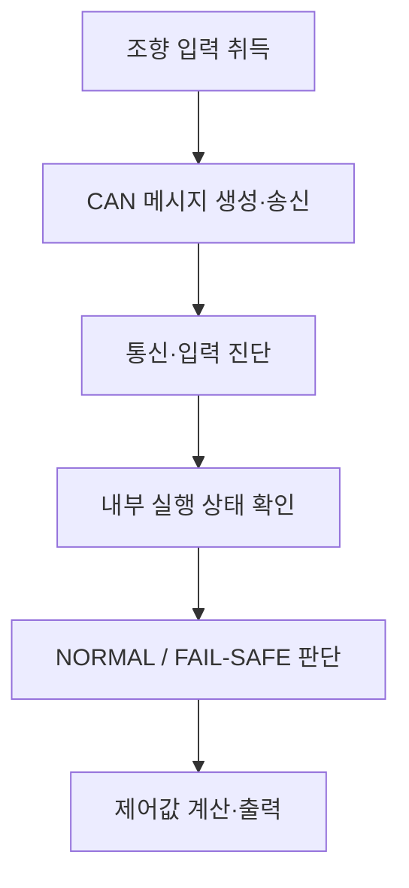

# 소프트웨어 요구사항 명세서 (Software Requirements Specification)

**Document ID**: STEER-03-SWRS  
**ISO 26262 Reference**: Part 6, Cl.6 (Software Safety Requirements Specification)  
**ASPICE Reference**: SWE.1 (Software Requirements Analysis)  
**Version**: 1.0  
**Date**: 2026-08-24  
**Status**: Draft  
**Project Title**: AUTOSAR 기반 조향 관련 오류에 대한 복구 및 진단 시스템  
**Subtitle**: 조향 입력 통신, 오류 진단, 안전 상태 제어 및 하드웨어 출력

---

## 1. 문서 목적

본 문서는 `01_Requirements.md`의 시스템 요구사항과 `02_System_Design.md`의 시스템 기능 및 설계 할당을 소프트웨어가 구현하고 시험할 수 있는 요구사항으로 구체화한다.

각 SW 요구사항은 상위 `Req`, `SYS-F`, `SYS-DES` ID를 참조한다. SWC 배치, Port Interface, Runnable, RTE API, Task Mapping, 내부 변수 및 소스코드 구조는 후속 `04_SW_Design_Implementation.md`에서 정의한다.

## 2. 적용 범위와 기준

| 항목 | 적용 기준 |
|---|---|
| 대상 ECU | 조향 입력 ECU, 조향 출력 ECU |
| 입력 정보 | 조향 입력값, Alive Counter, WdgM 상태 |
| 출력 정보 | 조향 방향, PWM 출력값, 동작 허가 상태, 시스템/Fault 상태 |
| 정상 입력 범위 | 조향값 `-512~511` |
| 주기 조건 | 입력 ECU의 조향 CAN 메시지 송신 주기 `10 ms` |
| 통신 메시지 | CAN ID `0x100`, DLC `3 Bytes` |
| 안전 상태 | `NORMAL`, `FAIL-SAFE` |
| 내부 실행 이상 | WdgM Global Status가 `FAILED`, `EXPIRED`, `STOPPED`인 경우 |
| 정상 복귀 | Fault가 해제된 뒤 정상 조건이 연속 3회 확인된 경우 |

> `10 ms`는 결과보고서에서 입력 ECU의 CAN 송신 Runnable과 Task Mapping에 대해 확인된 값이다. 출력 ECU의 수신 이후 기능은 Data Received Event 기반이므로 별도 주기값을 임의로 부여하지 않는다.

## 3. 소프트웨어 동작 흐름

## 4. SW 요구사항

### 4.1 조향 입력 및 CAN 송신

| SW Req. ID | SW 요구사항 | 검증 기준 | 상위 추적 ID |
|---|---|---|---|
| SWR-IN-001 | 입력 ECU SW는 조향 입력 장치의 값을 읽어 조향값으로 변환해야 한다. | 입력값 변화에 대응하는 조향값 생성 확인 | Req_001 / SYS-F-001 / SYS-DES-001 |
| SWR-IN-002 | 입력 ECU SW는 변환한 조향값을 `-512~511` 범위의 값으로 제공해야 한다. | 최솟값, 중간값, 최댓값 확인 | Req_001 / SYS-F-001 / SYS-DES-001 |
| SWR-COM-001 | 입력 ECU SW는 조향값과 Alive Counter를 포함한 CAN 메시지를 `10 ms` 주기로 송신해야 한다. | 연속 메시지의 송신 주기 확인 | Req_002 / SYS-F-002 / SYS-DES-002 |
| SWR-COM-002 | 조향 정보 메시지는 CAN ID `0x100`, DLC `3 Bytes`를 사용해야 한다. | CAN Trace의 ID와 DLC 확인 | Req_002 / SYS-F-002 / SYS-DES-002 |
| SWR-COM-003 | 입력 ECU SW는 메시지를 생성할 때마다 Alive Counter를 1씩 증가시켜야 한다. | 연속 메시지 Counter 증가 확인 | Req_002 / SYS-F-002 / SYS-DES-002 |

### 4.2 통신 및 입력 진단

| SW Req. ID | SW 요구사항 | 검증 기준 | 상위 추적 ID |
|---|---|---|---|
| SWR-DIAG-001 | 출력 ECU SW는 조향값 또는 Alive Counter 읽기에 실패하면 통신 Fault를 설정해야 한다. | 각 데이터 읽기 실패 주입 시 Fault 확인 | Req_003 / SYS-F-003 / SYS-DES-003 |
| SWR-DIAG-002 | 출력 ECU SW는 최초 정상 수신 시 Alive Counter를 비교 기준값으로 저장하고 Timeout을 판정하지 않아야 한다. | 최초 수신에서 Fault 미설정 확인 | Req_003 / SYS-F-003 / SYS-DES-003 |
| SWR-DIAG-003 | 출력 ECU SW는 동일한 Alive Counter가 연속 2회 이상 추가 수신되면 Timeout Fault를 설정해야 한다. | Counter 고정 후 판정 시점 확인 | Req_003 / SYS-F-003 / SYS-DES-003 |
| SWR-DIAG-004 | 출력 ECU SW는 Alive Counter가 갱신되면 동일 Counter 누적값을 초기화해야 한다. | Counter 재갱신 후 누적값 초기화 확인 | Req_003 / SYS-F-003 / SYS-DES-003 |
| SWR-DIAG-005 | 출력 ECU SW는 수신 조향값이 `-512` 미만 또는 `511` 초과이면 Invalid Fault를 설정해야 한다. | 경계 안팎의 입력값 시험 | Req_004 / SYS-F-004 / SYS-DES-004 |
| SWR-DIAG-006 | 출력 ECU SW는 통신 및 입력 진단 결과와 유효 조향값을 안전 상태 판단 기능에 제공해야 한다. | 진단 결과와 전달값 일치 확인 | Req_003, Req_004 / SYS-F-003, SYS-F-004 / SYS-DES-003, SYS-DES-004 |

### 4.3 내부 실행 상태 감시

| SW Req. ID | SW 요구사항 | 검증 기준 | 상위 추적 ID |
|---|---|---|---|
| SWR-WDG-001 | 출력 ECU SW는 WdgM으로부터 Global Status를 읽어 내부 실행 상태를 확인해야 한다. | WdgM 상태 입력별 판정 확인 | Req_005 / SYS-F-005 / SYS-DES-005 |
| SWR-WDG-002 | WdgM Global Status가 `FAILED`, `EXPIRED` 또는 `STOPPED`이면 내부 실행 Fault로 판단해야 한다. | 세 상태 각각에 대한 Fault 확인 | Req_005 / SYS-F-005 / SYS-DES-005 |
| SWR-WDG-003 | WdgM Global Status가 `EXPIRED`이면 최초 만료 Supervised Entity ID를 진단 정보로 취득해야 한다. | EXPIRED 주입 후 Entity ID 확인 | Req_005, Req_011 / SYS-F-005, SYS-F-011 / SYS-DES-005, SYS-DES-011 |

### 4.4 안전 상태 전환 및 복귀

| SW Req. ID | SW 요구사항 | 검증 기준 | 상위 추적 ID |
|---|---|---|---|
| SWR-SAFE-001 | 출력 ECU SW는 Timeout, Invalid 또는 내부 실행 Fault 중 하나 이상이 발생하면 시스템 상태를 `FAIL-SAFE`로 전환해야 한다. | Fault 종류별 상태 전환 확인 | Req_006 / SYS-F-006 / SYS-DES-006 |
| SWR-SAFE-002 | `FAIL-SAFE` 상태에서는 제어 기능에 전달하는 조향값을 `0`으로 설정하고 출력 동작을 금지해야 한다. | FAIL-SAFE 진입 시 조향값과 허가 상태 확인 | Req_007 / SYS-F-007 / SYS-DES-007 |
| SWR-SAFE-003 | Fault가 존재하는 동안 `FAIL-SAFE` 상태를 유지하고 정상 복귀 누적값을 초기화해야 한다. | Fault 지속 중 상태 유지 확인 | Req_006, Req_008 / SYS-F-006, SYS-F-008 / SYS-DES-006, SYS-DES-008 |
| SWR-SAFE-004 | `FAIL-SAFE` 상태에서 모든 Fault가 해제된 정상 조건이 연속 3회 확인되면 `NORMAL`로 복귀해야 한다. | 2회까지 유지, 3회째 복귀 확인 | Req_008 / SYS-F-008 / SYS-DES-008 |
| SWR-SAFE-005 | 정상 복귀 확인 중 Fault가 다시 발생하면 정상 복귀 누적값을 초기화해야 한다. | 정상 확인 도중 Fault 재주입 시험 | Req_008 / SYS-F-008 / SYS-DES-008 |

### 4.5 조향 제어 및 하드웨어 출력

| SW Req. ID | SW 요구사항 | 검증 기준 | 상위 추적 ID |
|---|---|---|---|
| SWR-CTRL-001 | `NORMAL` 상태에서 출력 ECU SW는 현재 조향값과 이전 조향값의 차이를 이용하여 좌·우 방향과 동작 여부를 결정해야 한다. | 증가·감소·정지 입력에 대한 방향 확인 | Req_009 / SYS-F-009 / SYS-DES-009 |
| SWR-CTRL-002 | 조향값 변화량의 절댓값이 `2` 이하이면 정지 상태로 결정해야 한다. | 변화량 1, 2, 3에 대한 경계 시험 | Req_009 / SYS-F-009 / SYS-DES-009 |
| SWR-CTRL-003 | 동작 상태에서는 조향값 변화량을 기준으로 PWM 값을 계산하고, 계산에 사용하는 변화량은 최대 `512`로 제한해야 한다. | 변화량별 PWM 및 상한 확인 | Req_009 / SYS-F-009 / SYS-DES-009 |
| SWR-CTRL-004 | 정지 상태 또는 `FAIL-SAFE` 상태에서는 PWM 값을 `0`으로 설정하고 좌·우 방향 출력을 모두 비활성화해야 한다. | 정지 및 Fault 상태 출력 확인 | Req_007, Req_009 / SYS-F-007, SYS-F-009 / SYS-DES-007, SYS-DES-009 |
| SWR-ACT-001 | 출력 ECU SW는 계산된 PWM 값과 방향 신호를 조향 출력 장치에 전달해야 한다. | 계산값과 하드웨어 출력 일치 확인 | Req_010 / SYS-F-010 / SYS-DES-010 |
| SWR-ACT-002 | 출력 ECU SW는 동작 금지 상태에서 PWM 출력과 두 방향 출력을 비활성화하고 정지 상태를 표시해야 한다. | 동작 금지 시 핀 및 표시 상태 확인 | Req_007, Req_010 / SYS-F-007, SYS-F-010 / SYS-DES-007, SYS-DES-010 |

### 4.6 진단 및 상태 제공

| SW Req. ID | SW 요구사항 | 검증 기준 | 상위 추적 ID |
|---|---|---|---|
| SWR-MON-001 | 출력 ECU SW는 현재 시스템 상태가 `NORMAL`인지 `FAIL-SAFE`인지 외부에서 확인할 수 있도록 제공해야 한다. | 상태별 모니터링 값 확인 | Req_011 / SYS-F-011 / SYS-DES-011 |
| SWR-MON-002 | 출력 ECU SW는 Timeout, Invalid 및 내부 실행 Fault를 구분하여 외부에서 확인할 수 있도록 제공해야 한다. | Fault 종류별 표시값 확인 | Req_011 / SYS-F-011 / SYS-DES-011 |
| SWR-MON-003 | 출력 ECU SW는 조향값, 안전 상태 및 출력 상태를 진단·모니터링 환경에 제공해야 한다. | CANoe 또는 디버거에서 상태 관측 확인 | Req_011 / SYS-F-011 / SYS-DES-011 |

## 5. SW 요구사항 할당 계획

| SW 요구사항 그룹 | 후속 SW 설계 요소 | 후속 검증 수준 |
|---|---|---|
| SWR-IN, SWR-COM | 조향 입력 및 CAN 송신 SWC | 단위·SW 통합·시스템 시험 |
| SWR-DIAG | CAN 수신 및 입력 진단 SWC | 단위·SW 통합·시스템 시험 |
| SWR-WDG | WdgM 연동 및 실행 감시 설계 | SW 통합·시스템 시험 |
| SWR-SAFE | 안전 상태 판단 SWC 및 상태 전이 | 단위·SW 통합·시스템 시험 |
| SWR-CTRL | 조향 제어 계산 SWC | 단위·SW 통합 시험 |
| SWR-ACT | PWM 및 Digital Output SWC | SW 통합·시스템 시험 |
| SWR-MON | 상태·Fault 모니터링 인터페이스 | SW 통합·시스템 시험 |

## 6. 상·하위 추적성 요약

| 시스템 요구사항 | 시스템 설계 | 파생 SW 요구사항 |
|---|---|---|
| Req_001 | SYS-F-001 / SYS-DES-001 | SWR-IN-001~002 |
| Req_002 | SYS-F-002 / SYS-DES-002 | SWR-COM-001~003 |
| Req_003 | SYS-F-003 / SYS-DES-003 | SWR-DIAG-001~004, SWR-DIAG-006 |
| Req_004 | SYS-F-004 / SYS-DES-004 | SWR-DIAG-005~006 |
| Req_005 | SYS-F-005 / SYS-DES-005 | SWR-WDG-001~003 |
| Req_006 | SYS-F-006 / SYS-DES-006 | SWR-SAFE-001, SWR-SAFE-003 |
| Req_007 | SYS-F-007 / SYS-DES-007 | SWR-SAFE-002, SWR-CTRL-004, SWR-ACT-002 |
| Req_008 | SYS-F-008 / SYS-DES-008 | SWR-SAFE-003~005 |
| Req_009 | SYS-F-009 / SYS-DES-009 | SWR-CTRL-001~004 |
| Req_010 | SYS-F-010 / SYS-DES-010 | SWR-ACT-001~002 |
| Req_011 | SYS-F-011 / SYS-DES-011 | SWR-WDG-003, SWR-MON-001~003 |

## 7. 후속 문서 전개 원칙

- `04_SW_Design_Implementation.md`는 각 `SWR-*`에 대해 SWC, Port Interface, Runnable, RTE API, Task/Event 및 구현 함수를 할당한다.
- 단위·통합·시스템 테스트 문서는 각 시험 항목에서 검증 대상 `SWR-*`를 참조한다.
- 요구사항 수치가 변경되면 해당 `SWR-*`, 설계 요소, 구현 및 Test Case의 영향 범위를 함께 검토한다.
- 전체 양방향 연결은 `Traceability_Matrix.md`에서 관리한다.

---

본 문서의 수치와 동작 조건은 첨부 결과보고서에 확인된 구현을 기준으로 작성하였다. 결과보고서에서 확인되지 않은 FTTI 및 출력 ECU의 고정 실행 주기는 요구사항으로 추가하지 않았다.
