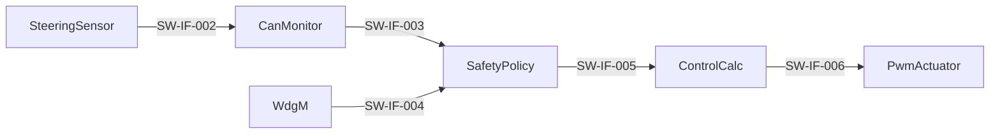

# 소프트웨어 통합 및 통합시험 명세서·결과서

**Document ID**: STEER-06-SWIT  
**ISO 26262 Reference**: Part 6, Cl.10  
**ASPICE Reference**: SWE.5 (Software Integration and Integration Test)  
**Version**: 1.0  
**Date**: 2026-08-24  
**Status**: Completed  
**Project Title**: AUTOSAR 기반 조향 관련 오류에 대한 복구 및 진단 시스템

---

## 1. 문서 목적

본 문서는 단위 검증이 완료된 소프트웨어 단위를 SWC와 ECU 소프트웨어로 통합하고, `0301_SW_Architecture_Design.md`에서 정의한 인터페이스·데이터 흐름·실행 관계가 올바르게 동작하는지 검증한 결과를 기록한다.

통합시험은 개별 함수 내부 알고리즘보다 SWC 간 RTE 연결, 입력 ECU와 출력 ECU 사이의 CAN 전달, WdgM 연동, 안전 상태 전파 및 IoHwAb 출력 경로를 대상으로 한다. 각 통합 Test Case는 `SWR-*`, `SW-IF-*`, `RUN-*`, `UNIT-*`를 참조한다.

## 2. 통합 대상

| 통합 그룹 | 포함 요소 | 주요 연결 |
|---|---|---|
| INTG-01 입력 처리 | UNIT-001 / SWC-001 | Analog IoHwAb → SteeringSensor → CAN Mapping |
| INTG-02 입력 진단 | UNIT-002 / SWC-002 | CAN Mapping → CanMonitor → SafetyPolicy Interface |
| INTG-03 안전 관리 | UNIT-003, UNIT-004 / SWC-003 | CanMonitor + WdgM → SafetyPolicy |
| INTG-04 제어 계산 | UNIT-005 / SWC-004 | SafetyPolicy → ControlCalc |
| INTG-05 하드웨어 출력 | UNIT-006 / SWC-005 | ControlCalc → PwmActuator → IoHwAb |
| INTG-06 End-to-End SW | UNIT-001부터 UNIT-006 | 조향 입력 → CAN → 진단 → 안전 판단 → 제어 → 출력 |

## 3. 통합 순서와 진입 기준

| 단계 | 통합 내용 | 진입 기준 | 완료 기준 |
|---|---|---|---|
| 1 | SteeringSensor–CAN Mapping | UNIT-001 단위시험 PASS | 조향값과 Counter가 CAN 신호로 전달됨 |
| 2 | CAN Mapping–CanMonitor | UNIT-002 단위시험 PASS | 수신 데이터와 진단 결과가 일치함 |
| 3 | CanMonitor–SafetyPolicy–WdgM | UNIT-003, UNIT-004 단위시험 PASS | Fault와 WdgM 상태가 안전 상태에 반영됨 |
| 4 | SafetyPolicy–ControlCalc | UNIT-005 단위시험 PASS | 안전 상태에 따른 제어 결과가 생성됨 |
| 5 | ControlCalc–PwmActuator–IoHwAb | UNIT-006 단위시험 PASS | PWM·방향·정지 출력이 HW Interface에 전달됨 |
| 6 | End-to-End SW 통합 | 단계 1부터 단계 5 PASS | 정상·Fault·복귀 흐름이 전체 경로에서 동작함 |

## 4. 시험 환경과 방법

| 항목 | 구성 |
|---|---|
| 대상 ECU | 입력 ECU, 출력 ECU |
| 대상 HW | MPC-5606B 기반 보드 |
| SW 플랫폼 | AUTOSAR Classic / Mobilgene Classic |
| 빌드·디버그 | CodeWarrior |
| 네트워크 관측 | CAN 메시지 및 상태값 모니터링 환경 |
| Fault Injection | CAN 갱신 정지, 비정상 조향값, WdgM Fault 상태 주입 |
| HW 관측 | PWM, 방향 Digital Output, 정지 상태 LED |
| 판정 | 입력·조건에 대한 SWC 중간값 및 최종 출력이 기대 결과와 일치하면 PASS |

## 5. 인터페이스 통합시험

| ITC ID | 통합 대상 | 시험 조건 | 기대 결과 | 추적 ID | 결과 |
|---|---|---|---|---|---|
| ITC-IF-001 | SW-IF-001 | 조향 입력 최소·중간·최대값 인가 | SteeringSensor에 대응 입력값 전달 | SWR-IN-001 / UNIT-001 / RUN-001 | PASS |
| ITC-IF-002 | SW-IF-002 | 입력 ECU에서 정상 조향 정보 송신 | 출력 ECU에서 조향값과 Alive Counter 수신 | SWR-COM-001, SWR-COM-002 / UNIT-001, UNIT-002 / RUN-001, RUN-002 | PASS |
| ITC-IF-003 | SW-IF-002 | 연속 CAN 메시지 송신 | Alive Counter가 메시지마다 갱신되어 전달 | SWR-COM-001, SWR-DIAG-001 / UNIT-001, UNIT-002 | PASS |
| ITC-IF-004 | SW-IF-003 | 정상 조향값과 정상 Counter 수신 | CanMonitor가 정상 조향값과 Fault FALSE 전달 | SWR-DIAG-001, SWR-DIAG-002, SWR-DIAG-003 / UNIT-002, UNIT-003 / RUN-002, RUN-003 | PASS |
| ITC-IF-005 | SW-IF-003 | 동일 Counter를 Timeout 기준까지 유지 | CanMonitor Fault가 SafetyPolicy에 전달 | SWR-DIAG-001, SWR-DIAG-003 / UNIT-002, UNIT-003 | PASS |
| ITC-IF-006 | SW-IF-003 | 유효 범위 밖 조향값 수신 | Invalid Fault가 SafetyPolicy에 전달 | SWR-DIAG-002, SWR-DIAG-003 / UNIT-002, UNIT-003 | PASS |
| ITC-IF-007 | SW-IF-004 | WdgM FAILED 상태 주입 | SafetyPolicy가 내부 실행 Fault로 수신 | SWR-WDG-001, SWR-WDG-002 / UNIT-003, UNIT-004 / RUN-003 | PASS |
| ITC-IF-008 | SW-IF-004 | WdgM EXPIRED 상태 주입 | 내부 실행 Fault 및 만료 대상 정보 취득 | SWR-WDG-002, SWR-MON-002 / UNIT-003, UNIT-004 | PASS |
| ITC-IF-009 | SW-IF-005 | 정상 진단 결과 전달 | 유효 조향값과 출력 허가 상태가 ControlCalc에 전달 | SWR-SAFE-001, SWR-CTRL-001 / UNIT-003, UNIT-005 / RUN-003, RUN-004 | PASS |
| ITC-IF-010 | SW-IF-005 | Fault 진단 결과 전달 | 안전 조향값과 출력 금지 상태가 ControlCalc에 전달 | SWR-SAFE-001, SWR-SAFE-002, SWR-SAFE-003 / UNIT-003, UNIT-005 | PASS |
| ITC-IF-011 | SW-IF-006 | 정상 조향값 변화 전달 | 계산된 PWM·방향·동작 허가가 PwmActuator에 전달 | SWR-CTRL-001, SWR-ACT-001 / UNIT-005, UNIT-006 / RUN-004, RUN-005 | PASS |
| ITC-IF-012 | SW-IF-006 | 정지 또는 Fault 상태 전달 | PWM 0과 방향 비활성 상태가 PwmActuator에 전달 | SWR-CTRL-002, SWR-ACT-002 / UNIT-005, UNIT-006 | PASS |
| ITC-IF-013 | SW-IF-007 | 정상 PWM·방향 입력 | IoHwAb PWM 및 방향 출력이 계산 결과와 일치 | SWR-ACT-001 / UNIT-006 / RUN-005 | PASS |
| ITC-IF-014 | SW-IF-007 | 출력 금지 상태 입력 | PWM과 두 방향 출력이 비활성화됨 | SWR-SAFE-002, SWR-SAFE-003, SWR-ACT-002 / UNIT-006 | PASS |
| ITC-IF-015 | SW-IF-008 | NORMAL, FAIL-SAFE 및 Fault 조건 생성 | 시스템 상태·Fault·출력 결과가 외부에서 구분되어 관측됨 | SWR-MON-001, SWR-MON-002, SWR-MON-003 / UNIT-003, UNIT-005, UNIT-006 | PASS |

## 6. Runnable 및 실행 흐름 통합시험

| ITC ID | 시험 조건 | 기대 결과 | 추적 ID | 결과 |
|---|---|---|---|---|
| ITC-RUN-001 | 입력 ECU 정상 실행 | RUN-001이 설정 주기에 따라 조향 정보 갱신 | SWR-COM-001 / RUN-001 / UNIT-001 | PASS |
| ITC-RUN-002 | 조향 CAN 데이터 수신 | RUN-002가 기동되어 진단 결과 생성 | SWR-COM-002, SWR-DIAG-001, SWR-DIAG-002 / RUN-002 / UNIT-002 | PASS |
| ITC-RUN-003 | CanMonitor 결과 수신 | RUN-003이 기동되고 WdgM 상태를 함께 반영 | SWR-DIAG-003, SWR-WDG-001, SWR-WDG-002 / RUN-003 / UNIT-003, UNIT-004 | PASS |
| ITC-RUN-004 | SafetyPolicy 결과 수신 | RUN-004가 기동되어 제어값 생성 | SWR-CTRL-001, SWR-CTRL-002 / RUN-004 / UNIT-005 | PASS |
| ITC-RUN-005 | ControlCalc 결과 수신 | RUN-005가 기동되어 IoHwAb 출력 반영 | SWR-ACT-001, SWR-ACT-002 / RUN-005 / UNIT-006 | PASS |
| ITC-RUN-006 | 정상 조향 정보 연속 입력 | RUN-002, RUN-003, RUN-004, RUN-005 순으로 데이터가 전달되고 이전 주기의 오래된 출력이 유지되지 않음 | SWR-COM-002, SWR-CTRL-001, SWR-ACT-001 / UNIT-002부터 UNIT-006 | PASS |

## 7. End-to-End SW 통합시험

| ITC ID | 시나리오 | 입력·Fault 조건 | 기대 결과 | 추적 ID | 결과 |
|---|---|---|---|---|---|
| ITC-E2E-001 | 정상 우측 조향 | 정상 CAN 갱신, 유효 조향값 증가, WdgM 정상 | NORMAL 유지, 우측 방향 및 PWM 출력 | SWR-IN-001, SWR-COM-001, SWR-COM-002, SWR-CTRL-001, SWR-ACT-001 | PASS |
| ITC-E2E-002 | 정상 좌측 조향 | 정상 CAN 갱신, 유효 조향값 감소, WdgM 정상 | NORMAL 유지, 좌측 방향 및 PWM 출력 | SWR-IN-001, SWR-COM-001, SWR-COM-002, SWR-CTRL-001, SWR-ACT-001 | PASS |
| ITC-E2E-003 | 조향 정지 | 변화량이 정지 조건 이내 | 방향 출력과 PWM 비활성 | SWR-CTRL-002, SWR-ACT-002 | PASS |
| ITC-E2E-004 | CAN 갱신 정지 | Alive Counter 미갱신 | Timeout 감지, FAIL-SAFE 전환, 조향 출력 차단 | SWR-DIAG-001, SWR-DIAG-003, SWR-SAFE-001, SWR-SAFE-002, SWR-SAFE-003 | PASS |
| ITC-E2E-005 | 비정상 조향값 | 유효 범위 밖 조향값 | Invalid 감지, FAIL-SAFE 전환, 조향 출력 차단 | SWR-DIAG-002, SWR-DIAG-003, SWR-SAFE-001, SWR-SAFE-002 | PASS |
| ITC-E2E-006 | 내부 실행 이상 | WdgM FAILED, EXPIRED 또는 STOPPED | 내부 Fault 감지, FAIL-SAFE 전환, 조향 출력 차단 | SWR-WDG-001, SWR-WDG-002, SWR-SAFE-001, SWR-SAFE-002 | PASS |
| ITC-E2E-007 | Fault 지속 | Timeout·Invalid 또는 WdgM Fault 유지 | FAIL-SAFE와 안전 출력 유지 | SWR-SAFE-003 | PASS |
| ITC-E2E-008 | 정상 복귀 | Fault 해제 후 정상 조건 연속 충족 | 기준 횟수 전까지 FAIL-SAFE 유지 후 NORMAL 복귀 | SWR-SAFE-004 | PASS |
| ITC-E2E-009 | 복귀 중 Fault 재발 | 정상 복귀 확인 중 Fault 재주입 | 복귀 중단, FAIL-SAFE 유지 | SWR-SAFE-005 | PASS |
| ITC-E2E-010 | 상태 모니터링 | 정상·Timeout·Invalid·WdgM Fault·복귀 조건 순차 생성 | 각 상태와 Fault 및 출력 결과가 외부에서 구분되어 관측 | SWR-MON-001, SWR-MON-002, SWR-MON-003 | PASS |

## 8. SW 요구사항–통합시험 추적성

| SW 요구사항 | 주요 통합 Test Case |
|---|---|
| SWR-IN-001 | ITC-IF-001, ITC-E2E-001, ITC-E2E-002 |
| SWR-COM-001 | ITC-IF-002, ITC-IF-003, ITC-RUN-001, ITC-E2E-001 |
| SWR-COM-002 | ITC-IF-002, ITC-RUN-002, ITC-RUN-006 |
| SWR-DIAG-001 | ITC-IF-003, ITC-IF-005, ITC-RUN-002, ITC-E2E-004 |
| SWR-DIAG-002 | ITC-IF-004, ITC-IF-006, ITC-RUN-002, ITC-E2E-005 |
| SWR-DIAG-003 | ITC-IF-004, ITC-IF-005, ITC-IF-006, ITC-RUN-003 |
| SWR-WDG-001 | ITC-IF-007, ITC-RUN-003, ITC-E2E-006 |
| SWR-WDG-002 | ITC-IF-007, ITC-IF-008, ITC-RUN-003, ITC-E2E-006 |
| SWR-SAFE-001 | ITC-IF-009, ITC-IF-010, ITC-E2E-004, ITC-E2E-005, ITC-E2E-006 |
| SWR-SAFE-002 | ITC-IF-010, ITC-IF-014, ITC-E2E-004, ITC-E2E-005, ITC-E2E-006 |
| SWR-SAFE-003 | ITC-IF-010, ITC-IF-014, ITC-E2E-004, ITC-E2E-007 |
| SWR-SAFE-004 | ITC-E2E-008 |
| SWR-SAFE-005 | ITC-E2E-009 |
| SWR-CTRL-001 | ITC-IF-009, ITC-IF-011, ITC-RUN-004, ITC-E2E-001, ITC-E2E-002 |
| SWR-CTRL-002 | ITC-IF-012, ITC-RUN-004, ITC-E2E-003 |
| SWR-ACT-001 | ITC-IF-011, ITC-IF-013, ITC-RUN-005, ITC-E2E-001, ITC-E2E-002 |
| SWR-ACT-002 | ITC-IF-012, ITC-IF-014, ITC-RUN-005, ITC-E2E-003 |
| SWR-MON-001 | ITC-IF-015, ITC-E2E-010 |
| SWR-MON-002 | ITC-IF-008, ITC-IF-015, ITC-E2E-010 |
| SWR-MON-003 | ITC-IF-015, ITC-E2E-010 |

## 9. 통합시험 결과 요약

| 시험 그룹 | 전체 | PASS | FAIL | BLOCKED |
|---|---:|---:|---:|---:|
| 인터페이스 통합시험 | 15 | 15 | 0 | 0 |
| Runnable·실행 흐름 시험 | 6 | 6 | 0 | 0 |
| End-to-End SW 통합시험 | 10 | 10 | 0 | 0 |
| 합계 | 31 | 31 | 0 | 0 |

### 수행 결과

- SWC Port와 Interface를 통한 데이터 전달이 정상적으로 동작하였다.
- 입력 ECU의 조향 정보와 Alive Counter가 CAN을 통해 출력 ECU에 전달되었다.
- Timeout, Invalid 및 WdgM Fault가 SafetyPolicy에 반영되어 FAIL-SAFE로 전환되었다.
- FAIL-SAFE 상태가 ControlCalc와 PwmActuator까지 전달되어 PWM과 방향 출력이 차단되었다.
- 정상 조건 충족 시 NORMAL 복귀와 조향 출력 재활성화가 확인되었다.
- 상태 및 Fault 정보가 모니터링 경로에서 구분되어 관측되었다.

> 개별 Test Log, CAN Trace, 디버거 캡처 및 HW 출력 캡처는 증적 경로에 연결하여 관리한다.

## 10. 완료 기준 및 회귀시험

- 모든 통합 Test Case가 PASS이거나 승인된 편차와 연결되어야 한다.
- 모든 `SWR-*`, `SW-IF-*`, `RUN-*`가 하나 이상의 통합 Test Case로 검증되어야 한다.
- Interface, Runnable Mapping, CAN Signal 또는 안전 로직 변경 시 영향받는 Test Case를 재수행해야 한다.
- FAIL 발생 시 결함 ID, 원인, 수정 Commit 및 재시험 결과를 연결해야 한다.
- 통합시험 완료 후 SWE.6 소프트웨어 검증 단계로 전달한다.

---

본 문서는 SWE.5 소프트웨어 통합 및 통합시험의 기준 산출물이다. 다음 단계에서는 통합된 ECU 소프트웨어가 전체 SW 요구사항을 충족하는지 SWE.6 관점에서 검증한다.
