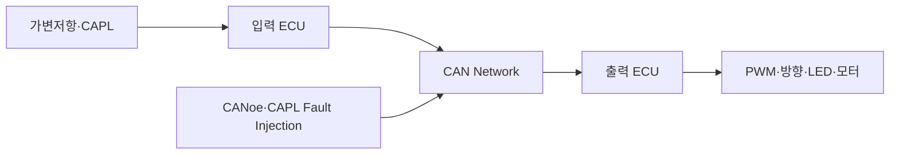

# 시스템 검증 명세서·결과서

**Document ID**: STEER-07-SYSV  
**ISO 26262 Reference**: Part 4, Cl.8  
**ASPICE Reference**: SYS.4 (System Integration and Integration Test)  
**Version**: 1.0  
**Date**: 2026-08-24  
**Status**: Completed  
**Project Title**: AUTOSAR 기반 조향 관련 오류에 대한 복구 및 진단 시스템

---

## 1. 문서 목적

본 문서는 조향 입력 장치, 입력 ECU, CAN Network, 출력 ECU 및 조향 출력 장치를 통합한 시스템이 `01_Requirements.md`의 `Req_001`부터 `Req_011`을 충족하는지 검증한 결과를 기록한다.

CANoe/CAPL을 이용하여 정상 조향 메시지와 통신·입력 Fault를 생성하고, CAN Trace와 실제 PWM·방향·정지 출력을 관측한다. CodeWarrior는 내부 상태를 최종 합격 기준으로 사용하지 않고, 결함 분석이 필요한 경우의 보조 관측 수단으로만 사용한다.

## 2. 검증 범위와 단계 정리

| 단계 | 프로젝트 적용 |
|---|---|
| SWE.4 | Stub/Mock 기반 소프트웨어 단위검증 |
| SWE.5 | PC 환경에서 SWC Interface와 Runnable 통합검증 |
| SWE.6 | 별도 공식 산출물로 주장하지 않음 |
| SYS.4 | CANoe/CAPL, 실제 ECU, CAN 및 조향 출력을 포함한 시스템검증 |

> `07_SW_Qualification_Verification.md`는 참고 초안으로만 취급하고 공식 수행 산출물에서는 제외한다. 본 프로젝트의 최종 검증 근거는 본 시스템검증 문서를 기준으로 관리한다.

## 3. 시험 대상 시스템

| System Element ID | 시험 대상 | 검증 내용 |
|---|---|---|
| SYS-E-001 | 조향 입력 장치 | 조향 입력 변화 제공 |
| SYS-E-002 | 입력 ECU | 조향값 및 Alive Counter 생성·송신 |
| SYS-E-003 | CAN Network | ECU 간 메시지 전달 및 CAPL Fault 주입 |
| SYS-E-004 | 출력 ECU | Timeout·Invalid·실행 이상 진단 및 안전 상태 판단 |
| SYS-E-005 | 조향 출력 장치 | PWM·좌우 방향·정지 동작 |
| SYS-E-006 | 진단·모니터링 환경 | CAN Trace, 상태 LED 및 출력 결과 관측 |

## 4. 시험 환경

| 항목 | 구성 |
|---|---|
| 입력 ECU | MPC-5606B 기반 ECU 보드 |
| 출력 ECU | MPC-5606B 기반 ECU 보드 |
| AUTOSAR 환경 | Mobilgene Classic 기반 생성 코드 및 SWC |
| 빌드·다운로드 | CodeWarrior |
| CAN 시험 | CANoe 및 CAPL |
| 입력 장치 | 가변저항 또는 CAPL 생성 조향 메시지 |
| 출력 장치 | PWM 출력, 좌·우 방향 Pin, 상태 LED 및 모터 |
| PWM 확인 | PWM 계측값 또는 오실로스코프·로직 분석기 |
| CAN 확인 | CANoe Trace, Signal 및 CAPL Test 결과 |

## 5. 시험 전제조건

- 입력 ECU와 출력 ECU에 검증 대상 Software Build가 정상 다운로드되어야 한다.
- 두 ECU와 CAN 장비의 Baud Rate 및 CAN DB 설정이 일치해야 한다.
- 조향 메시지의 CAN ID, DLC, Signal 및 Alive Counter Mapping이 설정되어야 한다.
- 출력 ECU의 PWM, 방향 Pin 및 상태 LED가 지정된 IoHwAb 채널에 연결되어야 한다.
- 각 Test Case 시작 전에 Fault와 정상 복귀 Counter가 초기 상태여야 한다.
- CAPL에서 정상 송신, Counter 고정, Invalid 값 및 정상 복귀 시나리오를 선택할 수 있어야 한다.

## 6. 시스템 Test Case

### 6.1 조향 입력 및 CAN 통신

| SYS-TC ID | 시험 조건·절차 | 기대 결과 | 관측 방법 | 추적 ID | 결과 |
|---|---|---|---|---|---|
| SYS-TC-001 | 가변저항을 최소·중간·최대 위치로 변경 | 조향값이 입력 변화에 대응하여 생성됨 | CANoe Signal/Trace | Req_001 / SYS-F-001 / SYS-DES-001 | PASS |
| SYS-TC-002 | 입력 ECU를 정상 동작시키고 조향 메시지 관측 | 조향 정보가 입력 ECU에서 출력 ECU로 주기적으로 전달됨 | CANoe Trace | Req_002 / SYS-F-002 / SYS-DES-002 | PASS |
| SYS-TC-003 | 정상 메시지를 연속 관측 | Alive Counter가 메시지마다 증가하고 조향 Signal이 정상 범위로 전달됨 | CANoe Trace | Req_002 / SYS-F-002 / SYS-DES-002 | PASS |

### 6.2 정상 조향 출력

| SYS-TC ID | 시험 조건·절차 | 기대 결과 | 관측 방법 | 추적 ID | 결과 |
|---|---|---|---|---|---|
| SYS-TC-004 | 정상 상태에서 조향 입력을 증가 | 우측 방향 출력과 입력 변화에 대응하는 PWM 출력 발생 | 방향 Pin, PWM, 모터 | Req_009, Req_010 / SYS-F-009, SYS-F-010 / SYS-DES-009, SYS-DES-010 | PASS |
| SYS-TC-005 | 정상 상태에서 조향 입력을 감소 | 좌측 방향 출력과 입력 변화에 대응하는 PWM 출력 발생 | 방향 Pin, PWM, 모터 | Req_009, Req_010 / SYS-F-009, SYS-F-010 / SYS-DES-009, SYS-DES-010 | PASS |
| SYS-TC-006 | 조향 입력 변화량을 정지 조건 이내로 유지 | 좌·우 방향과 PWM 출력이 비활성화되고 모터 정지 | 방향 Pin, PWM, 모터 | Req_009, Req_010 / SYS-F-009, SYS-F-010 / SYS-DES-009, SYS-DES-010 | PASS |

### 6.3 통신·입력 Fault 및 FAIL-SAFE

| SYS-TC ID | 시험 조건·절차 | 기대 결과 | 관측 방법 | 추적 ID | 결과 |
|---|---|---|---|---|---|
| SYS-TC-007 | CAPL에서 Alive Counter를 동일 값으로 반복 송신 | 갱신 이상이 감지되고 FAIL-SAFE로 전환되어 PWM과 방향 출력 차단 | CANoe Trace, PWM, 방향 Pin, LED, 모터 | Req_003, Req_006, Req_007 / SYS-F-003, SYS-F-006, SYS-F-007 / SYS-DES-003, SYS-DES-006, SYS-DES-007 | PASS |
| SYS-TC-008 | CAPL에서 정상 범위 미만의 조향값 송신 | Invalid가 감지되고 FAIL-SAFE로 전환되어 출력 차단 | CANoe Trace, PWM, 방향 Pin, LED, 모터 | Req_004, Req_006, Req_007 / SYS-F-004, SYS-F-006, SYS-F-007 / SYS-DES-004, SYS-DES-006, SYS-DES-007 | PASS |
| SYS-TC-009 | CAPL에서 정상 범위 초과의 조향값 송신 | Invalid가 감지되고 FAIL-SAFE로 전환되어 출력 차단 | CANoe Trace, PWM, 방향 Pin, LED, 모터 | Req_004, Req_006, Req_007 / SYS-F-004, SYS-F-006, SYS-F-007 / SYS-DES-004, SYS-DES-006, SYS-DES-007 | PASS |
| SYS-TC-010 | Fault 조건을 계속 유지하면서 조향값 변경 | FAIL-SAFE와 PWM·방향 출력 차단이 계속 유지됨 | PWM, 방향 Pin, LED, 모터 | Req_006, Req_007 / SYS-F-006, SYS-F-007 / SYS-DES-006, SYS-DES-007 | PASS |

### 6.4 내부 실행 이상

| SYS-TC ID | 시험 조건·절차 | 기대 결과 | 관측 방법 | 추적 ID | 결과 |
|---|---|---|---|---|---|
| SYS-TC-011 | 시험 설정에서 WdgM 감시 대상의 Checkpoint를 누락하거나 실행 이상 상태 생성 | 내부 실행 이상이 감지되고 FAIL-SAFE로 전환되어 출력 차단 | 상태 LED, PWM, 방향 Pin, 모터; 필요 시 CodeWarrior 보조 확인 | Req_005, Req_006, Req_007 / SYS-F-005, SYS-F-006, SYS-F-007 / SYS-DES-005, SYS-DES-006, SYS-DES-007 | PASS |

### 6.5 정상 상태 복귀

| SYS-TC ID | 시험 조건·절차 | 기대 결과 | 관측 방법 | 추적 ID | 결과 |
|---|---|---|---|---|---|
| SYS-TC-012 | Timeout 또는 Invalid Fault 해제 후 정상 메시지를 1회와 2회 송신 | 정상 복귀 기준 충족 전까지 FAIL-SAFE와 출력 차단 유지 | CANoe Trace, PWM, 방향 Pin, LED | Req_008 / SYS-F-008 / SYS-DES-008 | PASS |
| SYS-TC-013 | Fault 해제 후 정상 메시지를 연속 3회 송신 | 3회째 정상 조건에서 NORMAL 복귀 후 조향 출력 재활성화 | CANoe Trace, PWM, 방향 Pin, LED, 모터 | Req_008 / SYS-F-008 / SYS-DES-008 | PASS |
| SYS-TC-014 | 정상 메시지 2회 후 Timeout 또는 Invalid 재주입 | 정상 복귀가 중단되고 FAIL-SAFE와 출력 차단 유지 | CANoe Trace, PWM, 방향 Pin, LED | Req_008 / SYS-F-008 / SYS-DES-008 | PASS |

### 6.6 상태 및 Fault 관측

| SYS-TC ID | 시험 조건·절차 | 기대 결과 | 관측 방법 | 추적 ID | 결과 |
|---|---|---|---|---|---|
| SYS-TC-015 | NORMAL, Timeout, Invalid, WdgM Fault 및 정상 복귀 조건을 순서대로 실행 | 시스템 상태와 Fault 조건이 CANoe 정보, 상태 LED 또는 외부 출력 결과로 구분됨 | CANoe, LED, PWM, 방향 Pin | Req_011 / SYS-F-011 / SYS-DES-011 | PASS |

## 7. 시스템 요구사항 추적성

| 시스템 요구사항 | 검증 Test Case |
|---|---|
| Req_001 | SYS-TC-001 |
| Req_002 | SYS-TC-002, SYS-TC-003 |
| Req_003 | SYS-TC-007 |
| Req_004 | SYS-TC-008, SYS-TC-009 |
| Req_005 | SYS-TC-011 |
| Req_006 | SYS-TC-007, SYS-TC-008, SYS-TC-009, SYS-TC-010, SYS-TC-011 |
| Req_007 | SYS-TC-007, SYS-TC-008, SYS-TC-009, SYS-TC-010, SYS-TC-011 |
| Req_008 | SYS-TC-012, SYS-TC-013, SYS-TC-014 |
| Req_009 | SYS-TC-004, SYS-TC-005, SYS-TC-006 |
| Req_010 | SYS-TC-004, SYS-TC-005, SYS-TC-006 |
| Req_011 | SYS-TC-015 |

## 8. HARA 및 Safety Goal 검증 연결

| HARA ID | Safety Goal | 관련 시스템 Test Case |
|---|---|---|
| HC-01 | SG-01 | SYS-TC-007, SYS-TC-010 |
| HC-02 | SG-02 | SYS-TC-008, SYS-TC-009, SYS-TC-010 |
| HC-03 | SG-03 | SYS-TC-011 |
| HC-04 | SG-04 | SYS-TC-007, SYS-TC-008, SYS-TC-009, SYS-TC-011 |
| HC-05 | SG-05 | SYS-TC-012, SYS-TC-013, SYS-TC-014 |
| HC-06 | SG-06 | SYS-TC-004, SYS-TC-005, SYS-TC-006 |

## 9. 시험 결과 요약

| 시험 그룹 | 전체 | PASS | FAIL | BLOCKED |
|---|---:|---:|---:|---:|
| 조향 입력 및 CAN 통신 | 3 | 3 | 0 | 0 |
| 정상 조향 출력 | 3 | 3 | 0 | 0 |
| 통신·입력 Fault 및 FAIL-SAFE | 4 | 4 | 0 | 0 |
| 내부 실행 이상 | 1 | 1 | 0 | 0 |
| 정상 상태 복귀 | 3 | 3 | 0 | 0 |
| 상태 및 Fault 관측 | 1 | 1 | 0 | 0 |
| 합계 | 15 | 15 | 0 | 0 |

### 수행 결과

- 조향 입력이 CAN 메시지를 통해 출력 ECU에 전달되고 Alive Counter가 정상 갱신됨을 확인하였다.
- 조향 입력 변화에 따라 PWM과 좌·우 방향 및 모터 동작이 변경됨을 확인하였다.
- Alive Counter 고정 및 Invalid 값 주입 시 FAIL-SAFE 전환과 PWM·방향 출력 차단을 확인하였다.
- Fault 지속 중 안전 출력이 유지되고 정상 조건 충족 시 출력이 재활성화됨을 확인하였다.
- 시스템 요구사항 11개와 HARA의 Safety Goal 6개가 시스템 Test Case에 연결되었다.

> CAPL Source, CANoe Configuration, CAN Trace, PWM 계측 결과, 출력 Pin·LED·모터 사진 또는 영상은 각 `SYS-TC-*` ID와 연결하여 시험 증적으로 관리한다.

## 10. 합격 기준 및 회귀시험

- 모든 `Req_*`가 하나 이상의 `SYS-TC-*`에 연결되어야 한다.
- 모든 시스템 Test Case가 PASS이거나 승인된 편차와 연결되어야 한다.
- Software Build, CAN DB, CAPL 및 CANoe Configuration 버전이 시험 결과와 연결되어야 한다.
- 요구사항·CAN Signal·진단 조건·상태 전이·HW Mapping 변경 시 영향받는 Test Case를 재수행해야 한다.
- FAIL 발생 시 결함 ID, 수정 Commit 및 재시험 결과를 연결해야 한다.

---

본 문서는 CANoe/CAPL과 실제 ECU·조향 출력을 사용한 시스템검증의 기준 산출물이다.
